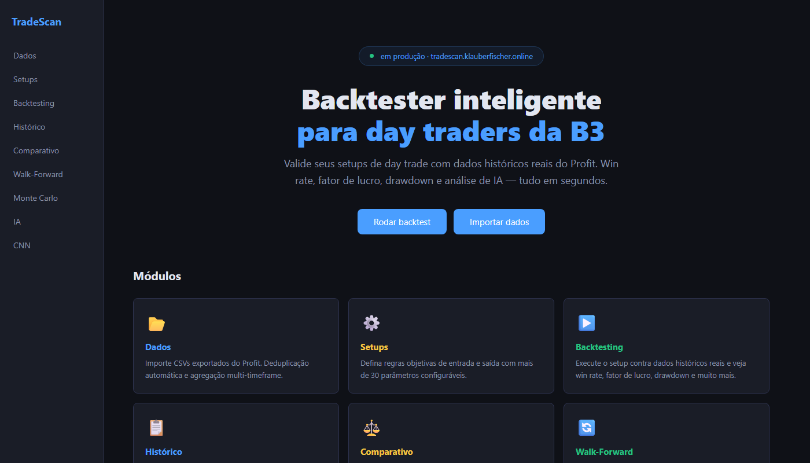
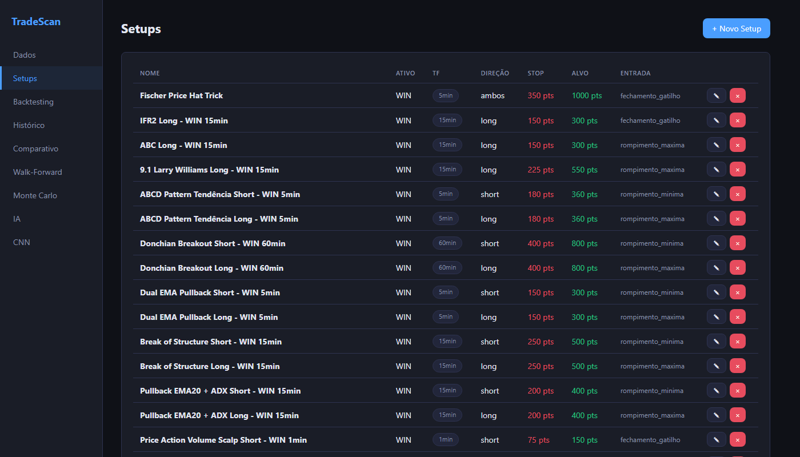
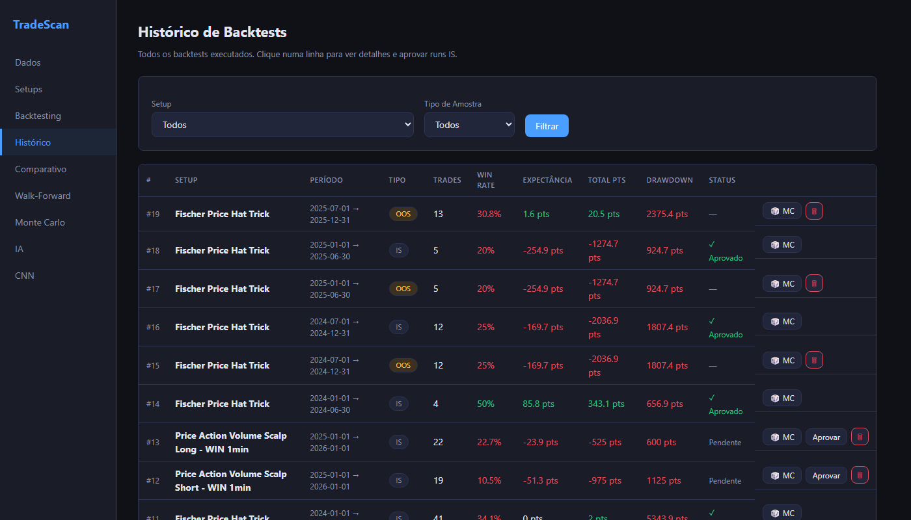
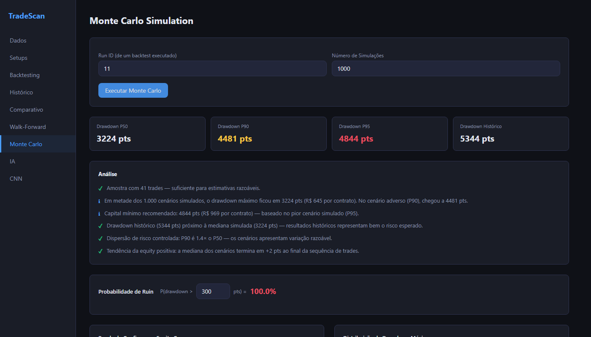

<div align="center">

# TradeScan

**Intelligent backtester for B3 day traders**

[](https://python.org)
[](https://fastapi.tiangolo.com)
[](https://react.dev)
[](https://duckdb.org)
[](https://pytorch.org)
[]()

**[tradescan.klauberfischer.online](https://tradescan.klauberfischer.online)**

</div>

---

Most traders define setups without ever validating them against historical data. TradeScan solves this: it imports data from Profit (Nelogica), runs backtests with objective rules, and delivers complete metrics — win rate, profit factor, drawdown, segmentation by time of day and market context.

Robust validation via Walk-Forward and Monte Carlo included. A 1D CNN trained on historical candles filters low-quality entries. No cloud dependencies, no usage costs.

---

## Screenshots


*Landing page with all modules and quick navigation.*


*Setup library with over 13 pre-calibrated configurations for WIN.*


*Complete run history with inline metrics, IS→OOS approval, and direct Monte Carlo access.*


*Monte Carlo simulation: max drawdown distribution, equity curve confidence band, and automatic natural language analysis.*

---

## Features

| Module | What it does |
|---|---|
| **Data** | CSV parsing from Profit with automatic ticker/timeframe detection. Deduplication by composite key. Multi-timeframe aggregation from base data (1min → 5min, 15min, 60min, D, W). |
| **Setups** | Over 30 configurable conditions: EMAs, RSI(2), ADX, ATR, candle sequences, opening gap, time window, S/R zone filter. 13 pre-calibrated setups for WIN. |
| **Backtesting** | Candle-by-candle engine with support for long, short, and both. Stop/target in points, slippage, cost per contract, multiple entries per day, optional CNN filter. |
| **Walk-Forward** | Sliding optimization + validation windows. Detects overfitting before trading by measuring out-of-sample efficiency and consistency. |
| **Monte Carlo** | Random permutation of the trade sequence in 1,000+ simulations. Returns max drawdown distribution (P10–P99), equity confidence band, and configurable ruin probability. |
| **CNN — Patterns** | 1D Convolutional network trained on the 50 candles preceding each entry. Used as a filter in the backtest: only executes if gain probability exceeds the defined threshold. |
| **Comparison** | Compares multiple setups side by side over the same historical period. |
| **History** | Complete record with in-sample run approval to unlock out-of-sample. |

---

## Technical Implementation

### 1. Ingestion Pipeline

The parser (`backend/ingestao/parser_csv.py`) reads Profit CSVs with support for multiple encodings (UTF-8, latin-1, cp1252) and two export formats (with and without header). The timeframe is automatically detected by calculating the median of deltas between consecutive candles and mapping to known timeframes with ±50% tolerance.

```python
# Automatic timeframe detection
mediana_delta = timestamps.diff().median().total_seconds()
# 60s → 1min | 300s → 5min | 900s → 15min | 3600s → 60min
```

After ingestion, base data is aggregated to derived timeframes via `pandas.resample()`, ensuring correct OHLCV (open=first, high=max, low=min, close=last, volume=sum).

---

### 2. Indicator Engine

The `backend/indicadores/calculos.py` module enriches each DataFrame with 15 fully vectorized calculated columns:

| Indicator | Implementation | Detail |
|---|---|---|
| MA200 | SMA(200) | `min_periods=200` — returns NaN until enough history is accumulated |
| EMA9 | EMA(9) | `adjust=False` (recursive formula, not window-weighted) |
| RSI(2) | Wilder RSI(2) | Smoothing α=1/2 on gains/losses; range 0–100 |
| ADX(14) | Wilder DM | True Range + DM+ / DM− with α=1/14; measures trend strength |
| Daily ATR | ATR(14) shifted -1 | **1-bar shift** to avoid lookahead bias in backtesting |
| Opening gap | `open_day − prev_close` | Calculated on first candle of the session |
| Accumulated range % | `(max_high − min_low) / open_day` | Intraday expansion — detects exhausted range |
| Weekly trend | Weekly resample | `>+0.5%` = up, `<−0.5%` = down, else sideways |
| Upper/lower wick | `high − max(open,close)` | Candle quality metrics |

---

### 3. Entry Signal Detection

`backend/backtesting/sinais.py` — function `gerar_entradas(df, setup)` — applies setup conditions as **vectorized boolean masks** over the entire DataFrame:

```python
mask = pd.Series(True, index=df.index)

# Candle filters
if setup.range_candle_min:
    mask &= df["range_candle"] >= setup.range_candle_min

# Relative position to MAs
if setup.mm200_posicao == "acima":
    mask &= df["close"] > df["mm200"]

# Momentum
if setup.ifr2_max:
    mask &= df["ifr2"] <= setup.ifr2_max  # oversold → long

# Time window
mask &= (df.index.time >= horario_inicio) & (df.index.time <= horario_fim)

# Trend strength
if setup.adx_min:
    mask &= df["adx"] >= setup.adx_min
```

**Candle sequence detection** (`_mask_seq`): identifies N consecutive bullish (close > open, high > prev_max_high) or bearish (close < open, low < prev_min_low) candles for momentum/trend-following setups. Includes optional max wick filter as % of the candle range.

**S/R zone filter**: when enabled, blocks entries on candles that touch the day's percentage levels (±0.5%, ±1.0%, ..., ±3.0% relative to the open), avoiding entries in resistance/support zones.

**Entry price**: calculated according to the setup's `entry_type` — trigger candle close, high/low breakout, or close with slippage.

---

### 4. Backtesting Engine

`backend/backtesting/motor.py` runs candle-by-candle (not vectorized — necessary to correctly simulate stop/target):

```
For each candle with an entry signal:
  1. Check daily entry limit
  2. Apply CNN filter (optional) → skip if prob < threshold
  3. Open position: entry_price ± slippage
  4. Scan subsequent candles:
     - (long)  low  ≤ stop_price  → stop
     - (long)  high ≥ target_price → target
     - Same candle: both hit → compute stop (conservative)
  5. EOD forced: close position without carrying overnight
```

**Dynamic target**: when `target_nearby_pct_day` is active, the target is the nearest percentage level (0.5%, 1.0%, ..., 3.0%) with a configurable minimum distance, making the target adaptive to the day's volatility.

**Trade context**: each trade stores a `context_json` with weekly trend, time of day, gap type, accumulated range band, relative position to MA200/EMA9, and RSI(2) value at entry — the basis for result segmentation.

---

### 5. Walk-Forward Analysis

`backend/backtesting/walk_forward.py` — validates whether a setup has **robustness outside the optimization window**:

```
Window 1:  IN  [Jan–Jun 2024]  OUT  [Jul 2024]
Window 2:  IN  [Feb–Jul 2024]  OUT  [Aug 2024]
...
```

Consolidated metrics:
- **Efficiency** = `out_expectancy / in_expectancy` — values < 0.3 indicate severe overfitting
- **Consistency** = % of out-of-sample windows with positive expectancy

A setup with efficiency ≥ 0.6 and consistency ≥ 60% is considered robust for live trading.

---

### 6. Monte Carlo

`backend/backtesting/monte_carlo.py` — answers the question: *"if the trades had arrived in a different order, what would the worst-case scenario be?"*

```python
for _ in range(n_simulations):
    shuffled = np.random.permutation(result_pts)
    equity = np.cumsum(shuffled)
    drawdown = np.maximum.accumulate(equity) - equity
    max_drawdowns.append(drawdown.max())
```

Returns P10/P25/P50/P75/P90/P95/P99 percentiles of max drawdown and final equity, plus a confidence band (P10–P90) along the trade sequence. P95 is the drawdown the trader must be able to withstand psychologically to trade the setup.

---

### 7. Pattern CNN (1D Convolutional)

`backend/padroes/modelo.py` — network trained on the 50 candles preceding each historical entry to classify whether that pattern has a high probability of gain.

**`PatternCNN` Architecture:**

```
Input: (batch, 10 features, 50 candles)
  │
  ├─ Conv1d(10→32, kernel=3) + BatchNorm + ReLU
  ├─ Conv1d(32→64, kernel=3) + BatchNorm + ReLU
  ├─ Conv1d(64→128, kernel=3) + BatchNorm + ReLU
  │
  ├─ AdaptiveAvgPool1d(1)  →  (batch, 128)
  │
  ├─ Dropout(0.3) → Linear(128→64) → ReLU
  └─ Dropout(0.2) → Linear(64→2)

Output: softmax → P(gain)
```

**10 features per candle:** `open, high, low, close, volume_fin, mm200, mme9, ifr2, accumulated_range_pct, candle_range`

**Per-window normalization (z-score):** each 50-candle window is normalized independently to avoid lookahead bias — the model never sees global statistics calculated with future data.

**Training:**
- Labels automatically generated from backtests: winning trade → 1, loss/breakeven → 0
- Temporal 70/15/15 split (train/validation/test) — no shuffle to preserve chronological order
- `CrossEntropyLoss` with class weights inversely proportional to frequency (compensates for imbalance)
- Early stopping with patience=10 epochs, monitoring validation F1
- Automatic overfitting alert if `F1_train − F1_val > 0.10`

After training, the model is available as an optional filter in the backtest: entries with `P(gain) < threshold` are skipped.

---

## Stack

```
Backend    Python 3.12 · FastAPI · DuckDB · PyTorch (CPU)
Frontend   React 18 · Vite · Recharts
Deploy     Docker · Nginx · Traefik · VPS
```

DuckDB embedded in the process — no database container, no network overhead. Analytical queries over dense time series in milliseconds. Data persisted in Docker volume (`tradescan-dados`), models in a separate volume (`tradescan-models`).

---

## Usage

```bash
# Backend
pip install -r requirements.txt
python -m backend.banco.seed
uvicorn backend.main:app --reload

# Frontend
cd frontend && npm install && npm run dev
```

Access `http://localhost:5173`. Export candles from Profit as CSV, import in the Data screen, and run your first backtest.

---

## Deploy

```bash
cp .env.prod.example .env.prod  # fill in ANTHROPIC_API_KEY
docker compose -f docker-compose.prod.yml --env-file .env.prod up -d --build
```

Full guide: [`docs/deploy-vps.md`](docs/deploy-vps.md)

---

<div align="center">

**[tradescan.klauberfischer.online](https://tradescan.klauberfischer.online)**

</div>
